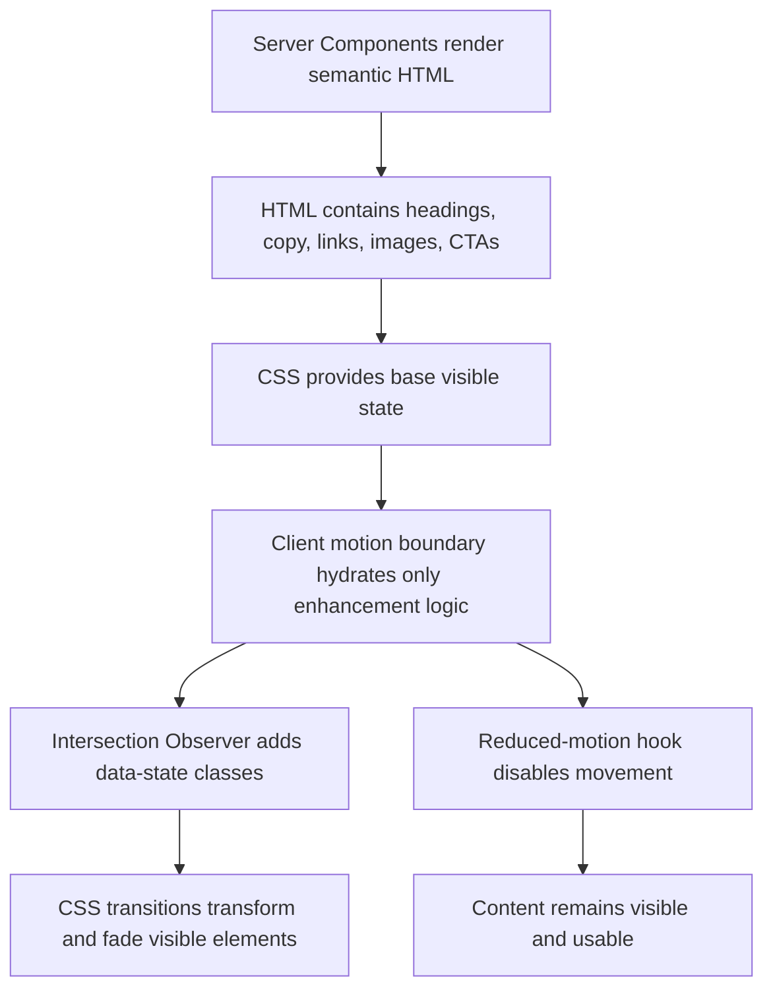

# Cinematic Animation Master Plan

> **Implementation status:** Phases 1–3 and 6 completed (2026-06-24). See `ANIMATION_IMPLEMENTATION_REPORT.md` for details. Phases 4–5 deferred until dashboard routes and multi-route navigation exist.

Production-ready motion architecture for the Al Hamdan Digital Next.js application.

## Executive Summary

This application is currently a static, server-rendered Arabic/RTL marketing site built with Next.js App Router. It has strong foundations for SEO because the visible content is rendered as HTML, fonts use `next/font`, and imagery is mostly served through `next/image`. The current experience is visually composed but almost entirely static. The main opportunity is to add a premium motion layer that improves perceived quality without turning the page into a JavaScript-heavy animation site.

The recommended strategy is progressive enhancement:

- Keep all business content, headings, CTAs, navigation labels, and section copy present in server-rendered HTML.
- Use CSS transitions and keyframes as the default motion primitive.
- Add a small client-only reveal system for scroll-triggered orchestration.
- Use React View Transitions only for future route-level continuity, after enabling the Next.js experimental flag.
- Avoid heavy animation libraries unless a future interaction genuinely requires timeline-level sequencing.
- Enforce a zero-horizontal-overflow policy before adding translate, scale, parallax, or pinned visual effects.

The target result should feel polished, cinematic, and trustworthy, but still fast on mobile, crawlable, accessible, and easy to maintain.

## Project Audit

### Current Stack

| Area | Current state | Notes for motion |
| --- | --- | --- |
| Framework | Next.js `16.2.9` | Local docs in `node_modules/next/dist/docs/` confirm App Router, Server Components by default, View Transitions behind `experimental.viewTransition`. |
| React | React `19.2.4` | App Router uses React features such as Server Components and can use `ViewTransition` when enabled. |
| Routing | App Router | Only `app/page.tsx` and `app/layout.tsx` exist. No nested routes yet. |
| Rendering | Server Components by default | `app/page.tsx`, `DesktopHome`, and `ResponsiveHome` are server-rendered. This is good for SEO. |
| Data fetching | Static local arrays in `components/home/data.ts` | No dynamic fetches, no request-time APIs, no route handlers. Route should be statically prerenderable. |
| Styling | Tailwind CSS 4, CSS variables, shadcn theme tokens, `tw-animate-css` | Existing UI primitives already use `animate-in`, `fade-in`, `zoom-in`, sheet slide classes, skeleton pulse, and CSS transitions. |
| UI primitives | shadcn/Radix/Base UI style components under `components/ui` | Many components are client components, but most are not currently used on the home page. |
| Icons | `lucide-react` | Safe for microinteractions; animate icon transforms only lightly. |
| Images | `next/image` plus one raw `` | Most images use dimensions. `market-visual.webp` currently uses raw `` and should be migrated before advanced motion. |
| Animation libraries | No Framer Motion, GSAP, Motion One | Current stack should start with CSS and tiny Intersection Observer helpers. |
| Fonts | `next/font/google` with Geist and IBM Plex Sans Arabic | Good for CLS and RTL language support. |

### Local Next.js Guidance Read

The plan follows these installed Next.js docs:

- `01-app/01-getting-started/02-project-structure.md`
- `01-app/01-getting-started/05-server-and-client-components.md`
- `01-app/02-guides/view-transitions.md`
- `01-app/02-guides/lazy-loading.md`
- `01-app/02-guides/prefetching.md`
- `01-app/02-guides/production-checklist.md`

Important constraints from those docs:

- Pages and layouts are Server Components by default.
- Add `"use client"` only to the smallest interactive boundary.
- Server Components help reduce client JavaScript and improve FCP.
- Lazy loading applies mainly to Client Components and browser-only libraries.
- View Transitions require `experimental.viewTransition: true` in `next.config.ts`.
- Next.js automatically prefetches links in production; custom prefetch behavior should be used sparingly.
- Metadata, sitemap, robots, optimized images, and `next/font` are part of production SEO and performance hygiene.

### Current Route And Rendering Strategy

Current route tree:

```text
app/
  layout.tsx
  page.tsx
```

Current rendering:

- `app/layout.tsx` exports static metadata.
- `app/page.tsx` renders one home route.
- The route imports both `ResponsiveHome` and `DesktopHome`.
- Both responsive and desktop content are included in HTML, with Tailwind breakpoints hiding one version visually.
- There is no client-side state in the live home page.
- There is no route transition surface yet because there is only one route.

SEO benefit:

- Core page content exists in the initial HTML.
- Search crawlers do not need animation JavaScript to discover primary content.

Performance risk:

- Mobile and desktop duplicate most page content in the DOM.
- Large desktop layout is fixed at `1440px` wide and `6558px` tall.
- `app/page.tsx` uses `overflow-x-auto`, which directly conflicts with the requested zero-horizontal-overflow outcome.

### Existing UI Analysis

| UI area | Current files | Current behavior | Animation opportunity | Risk |
| --- | --- | --- | --- | --- |
| Header/nav | `DesktopHome`, `ResponsiveHome` | Desktop absolute header, mobile sticky header | Subtle glass settle on load, active nav underline, hover lift | Avoid moving sticky header during scroll or route transitions. |
| Hero | `DesktopHome`, `ResponsiveHome` | Text, CTA, priority hero image | Cinematic first paint: image fade/scale, text stagger, CTA emphasis | Must not hide H1 from HTML or delay LCP image. |
| About cards | `aboutCards` mapped cards | Static cards with icons | Scroll reveal, icon glow, card hover | Excessive stagger can slow scanning. |
| Vision/mission | `visionMission` cards | Static cards | Gentle reveal, icon pulse once | Avoid looping sparkle effects. |
| Process steps | `steps` grid | Static numbered sequence | Sequential reveal and connecting rhythm | Six-card stagger must finish quickly on mobile. |
| Products | `products` cards with images | Static product grid | Product image float on hover, card reveal | Decorative product motion must not shift layout. |
| Services | Dark split section | Image composite plus service list | Cinematic masked reveal, image depth drift | Parallax could cause overflow and GPU load. |
| Sectors | Cards over skewed blue band | Static card grid | Band wipe plus card reveal | Skewed full-width band already risks overflow. |
| Why section | Blue section with phone image and checklist | Static | Phone reveal, checklist cascade | Avoid large y-axis travel. |
| Market section | Text plus raw image | Static | Text reveal, image depth fade | Replace raw `` with `next/image` before image motion. |
| Footer | Contact, links, logo | Static | Minimal fade on entry, back-to-top hover | Footer content should remain stable and readable. |
| UI primitives | `components/ui/*` | Radix/shadcn interactions available | Keep existing tiny open/close motion | Ensure reduced motion overrides cover these classes. |

### Existing Pages By Type

| Type | Present now | Notes |
| --- | --- | --- |
| Landing page | Yes, home page | Primary focus of this plan. |
| Marketing pages | Not yet | Future pages should reuse the same motion primitives. |
| Dashboard pages | Not yet | Guidelines included for future SaaS sections. |
| Forms | UI primitives exist, not used on home | Future contact/lead forms need restrained feedback motion. |
| Cards | Yes | Main reusable animation target. |
| Modals | UI primitives exist, not used on home | Already have short Radix enter/exit classes. |
| Navigation systems | Header nav exists, many menu primitives exist | Header needs anchor/link semantics before advanced nav motion. |
| Charts/tables | UI primitives exist, not used on home | Future dashboard strategy included. |

## SEO-Safe Animation Architecture

### Core Rule

Animation must never be responsible for rendering, discovering, or understanding content. It may only decorate content that is already present in semantic HTML.

### Architecture Diagram



### Search Engine Crawling Requirements

Allowed:

- Render all text, headings, links, CTA labels, lists, and image alt text on the server.
- Use classes such as `data-motion="pending"` only when the non-JS fallback remains visible or becomes visible by CSS default.
- Use decorative transforms and opacity changes after first paint.
- Use `next/image` with explicit width and height for motion targets.
- Keep route metadata in `app/layout.tsx` or page-level metadata exports.

Forbidden:

- Rendering important text only after `useEffect`.
- Fetching marketing copy client-side for animation timing.
- Using canvas/WebGL as the only representation of meaningful content.
- Setting initial content to `display: none` or `visibility: hidden` until JavaScript runs.
- Animating layout properties that cause text or CTAs to jump after crawlable HTML is painted.
- Duplicating mobile/desktop copy indefinitely as the content model grows.

### Recommended Reveal Contract

Every revealable element should follow this contract:

1. It exists in server-rendered HTML.
2. It has a stable final layout before animation.
3. Its default no-JS state is readable.
4. JavaScript may add `data-motion-state="idle"` before paint only inside a tiny client wrapper.
5. Intersection Observer changes it to `data-motion-state="visible"`.
6. A timeout fallback makes it visible if the observer fails.

Example CSS-safe default:

```css
.motion-reveal {
  opacity: 1;
  transform: none;
}

html.motion-ready .motion-reveal[data-motion-state="idle"] {
  opacity: 0;
  transform: translate3d(0, 16px, 0);
}

html.motion-ready .motion-reveal[data-motion-state="visible"] {
  opacity: 1;
  transform: translate3d(0, 0, 0);
  transition:
    opacity var(--motion-duration-medium) var(--motion-ease-out),
    transform var(--motion-duration-medium) var(--motion-ease-out);
}
```

This avoids a no-JS hidden-content failure.

## Core Web Vitals Protection

### LCP

Allowed:

- Hero image may use a very subtle CSS opacity/scale transition after it has reserved layout space.
- H1 may appear immediately, then enhance with a small opacity or y-offset transition.
- Use `priority` only for true above-the-fold images.

Forbidden:

- Delaying the hero image with JavaScript timelines.
- Waiting for animation libraries before painting the H1.
- Applying large blur filters to the LCP image during initial render.
- Replacing the hero with video or canvas without a static HTML fallback.

### CLS

Allowed:

- Animate `opacity`, `transform`, and CSS custom properties that do not affect layout.
- Reserve dimensions for images, sections, cards, and sticky headers.
- Use `aspect-ratio`, fixed media dimensions, or grid constraints.

Forbidden:

- Animating `height`, `width`, `top`, `left`, `margin`, `padding`, or font size for entrance effects.
- Inserting content above already-rendered content after hydration.
- Staggering content in a way that changes document height while the user scrolls.

### INP

Allowed:

- Button/tap feedback under 120ms.
- Use CSS hover/focus/active states.
- Keep observers batched and passive.

Forbidden:

- Starting heavy timelines on click before navigation.
- Running scroll handlers every frame without `requestAnimationFrame`.
- Loading Framer/GSAP globally for small hover states.

### FCP And TTFB

Allowed:

- Keep home page as a static Server Component.
- Keep motion wrappers small and client-only.
- Use CSS-first animation.

Forbidden:

- Moving whole route into a `"use client"` component.
- Adding request-time APIs to `app/layout.tsx`.
- Adding blocking animation setup to the server path.

### Lighthouse Targets

| Category | Target | Motion implication |
| --- | --- | --- |
| Performance | 90+ | Animation JS must be small, deferred, and non-blocking. |
| Accessibility | 95+ | Reduced motion, focus visibility, semantic controls, and no keyboard traps. |
| Best Practices | 95+ | Avoid deprecated APIs, oversized main-thread work, and unsafe script patterns. |
| SEO | 100 | Server-render content, metadata, crawlable links, sitemap, robots, canonical URLs. |

## Motion Design Principles

The application should feel:

- Smooth: no abrupt pops except intentional instant feedback.
- Elegant: restrained timing and premium easing.
- Intentional: every motion explains hierarchy, continuity, progress, or affordance.
- Cinematic: depth, pacing, and scene composition, not random movement.
- Trustworthy: motion supports clarity and conversion.

Avoid:

- Excessive bouncing.
- Infinite decorative loops.
- Flashing effects.
- Aggressive parallax.
- Large zooms on text.
- Random delays that make the interface feel slow.
- Animation that competes with Arabic reading flow.

RTL-specific principle:

- Directional motion should respect `dir="rtl"`. For Arabic reading contexts, "forward" visual motion can move right-to-left when it follows reading flow, but route hierarchy can still use semantic transition types. Decide per navigation pattern and document it in code comments.

## Global Motion System

### Motion Tokens

Add these tokens to `app/globals.css` under `:root`:

```css
:root {
  --motion-duration-instant: 80ms;
  --motion-duration-fast: 140ms;
  --motion-duration-medium: 240ms;
  --motion-duration-slow: 420ms;
  --motion-duration-cinematic: 720ms;

  --motion-ease-out: cubic-bezier(0.16, 1, 0.3, 1);
  --motion-ease-in: cubic-bezier(0.7, 0, 0.84, 0);
  --motion-ease-in-out: cubic-bezier(0.65, 0, 0.35, 1);
  --motion-ease-emphasized: cubic-bezier(0.2, 0.8, 0.2, 1);

  --motion-distance-xs: 4px;
  --motion-distance-sm: 8px;
  --motion-distance-md: 16px;
  --motion-distance-lg: 28px;
  --motion-distance-xl: 48px;

  --motion-scale-hover: 1.015;
  --motion-scale-press: 0.985;
  --motion-blur-soft: 8px;
}
```

### Timing Rules

| Use case | Duration | Easing | Notes |
| --- | --- | --- | --- |
| Button press | 80-120ms | ease-out | Must feel instant. |
| Hover elevation | 140-180ms | ease-out | Small transform and shadow only. |
| Menu open/close | 100-180ms | ease-out/in | Existing UI primitives are close to this. |
| Card reveal | 220-320ms | ease-out | Stagger max 45ms per item. |
| Section reveal | 360-520ms | emphasized | Use for major scene changes only. |
| Hero cinematic load | 520-720ms | emphasized | No blocking of content. |
| Route transition | 180-400ms | in-out | Never delay navigation. |
| Reduced motion | 0-120ms | linear/ease-out | Prefer opacity only or instant. |

### Reusable Spring Presets

If a future library is introduced, use these conceptual presets:

| Preset | Use | Behavior |
| --- | --- | --- |
| `snappy` | toggles, tabs, small controls | High stiffness, low bounce, under 180ms. |
| `soft` | cards, panels, drawers | Medium stiffness, no bounce, under 280ms. |
| `cinematic` | hero imagery, section transitions | Lower stiffness, long settle, no elastic bounce. |
| `data` | charts and dashboard values | Short, precise, no overshoot. |

## Implementation Architecture

### Proposed File Structure

```text
components/
  motion/
    MotionProvider.tsx
    Reveal.tsx
    Stagger.tsx
    useReducedMotion.ts
    useInViewOnce.ts
lib/
  motion/
    tokens.ts
    capability.ts
app/
  globals.css
```

### Client Boundary Rule

Only `components/motion/*` should need `"use client"` for landing-page animation. Do not convert `app/page.tsx`, `ResponsiveHome`, or `DesktopHome` wholesale into Client Components.

### Reveal Component Example

```tsx
"use client";

import { useEffect, useRef, useState } from "react";

type RevealProps = {
  as?: keyof JSX.IntrinsicElements;
  children: React.ReactNode;
  className?: string;
  delay?: number;
  threshold?: number;
};

export function Reveal({
  as: Tag = "div",
  children,
  className,
  delay = 0,
  threshold = 0.25,
}: RevealProps) {
  const ref = useRef<HTMLElement | null>(null);
  const [visible, setVisible] = useState(false);

  useEffect(() => {
    const node = ref.current;
    if (!node || visible) return;

    const fallback = window.setTimeout(() => setVisible(true), 2000);

    const observer = new IntersectionObserver(
      ([entry]) => {
        if (entry?.isIntersecting) {
          setVisible(true);
          observer.disconnect();
          window.clearTimeout(fallback);
        }
      },
      {
        root: null,
        rootMargin: "0px 0px -12% 0px",
        threshold,
      }
    );

    observer.observe(node);

    return () => {
      observer.disconnect();
      window.clearTimeout(fallback);
    };
  }, [threshold, visible]);

  return (
    <Tag
      ref={ref as never}
      className={className}
      data-motion="reveal"
      data-motion-state={visible ? "visible" : "idle"}
      style={{ "--motion-delay": `${delay}ms` } as React.CSSProperties}
    >
      {children}
    </Tag>
  );
}
```

### Reveal CSS Example

```css
[data-motion="reveal"] {
  opacity: 1;
  transform: none;
}

html.motion-ready [data-motion="reveal"][data-motion-state="idle"] {
  opacity: 0;
  transform: translate3d(0, var(--motion-distance-md), 0);
}

html.motion-ready [data-motion="reveal"][data-motion-state="visible"] {
  opacity: 1;
  transform: translate3d(0, 0, 0);
  transition:
    opacity var(--motion-duration-medium) var(--motion-ease-out),
    transform var(--motion-duration-medium) var(--motion-ease-out);
  transition-delay: var(--motion-delay, 0ms);
}
```

## Page Transition Strategy

### Current State

There is only one route today, so route transitions are not currently useful. Build the foundation but do not add route-transition code until additional routes exist.

### Future Route Transition Rules

| Scenario | Motion | Max duration | Mobile behavior | SEO risk |
| --- | --- | --- | --- | --- |
| Marketing page to marketing page | Soft content crossfade plus 16px directional drift | 320ms | Fade only below 768px | Low if content is server-rendered. |
| Product list to product detail | Shared image morph using React View Transition | 400ms | Morph disabled on low-end devices | Low if both pages render images and copy in HTML. |
| Dashboard section change | Instant shell persistence, leaf content fade | 180ms | No slide | Low. |
| Modal route | Overlay fade, panel scale 0.98 to 1 | 180ms | Drawer-style translate up under 640px | Low if focus is managed. |

### Next.js View Transition Setup

Only when multiple routes exist, update `next.config.ts`:

```ts
import type { NextConfig } from "next";

const nextConfig: NextConfig = {
  experimental: {
    viewTransition: true,
  },
};

export default nextConfig;
```

Use `ViewTransition` from React for named shared elements and use `transitionTypes` on `Link` when direction has meaning. Keep the header anchored so it does not slide with page content.

### Route Transition Prohibitions

- Do not block route changes until an exit animation finishes.
- Do not animate the whole `body`.
- Do not route-transition the sticky header unless the header itself changes.
- Do not use route transitions as loading spinners.
- Do not require JavaScript for destination content to exist.

## Scroll Animation Safety System

Scroll animation is the highest-risk part of this plan. The implementation must handle fast scrolling, observer failures, mobile viewport differences, and reduced motion.

### Problem 1: Animation Happens Before User Sees It

Use Intersection Observer with conservative thresholds:

| Element type | Desktop threshold | Mobile threshold | Root margin |
| --- | --- | --- | --- |
| Hero | No observer, animate after first paint | No observer | None |
| Section heading | `0.2` | `0.12` | `0px 0px -10% 0px` |
| Cards | `0.18` | `0.1` | `0px 0px -8% 0px` |
| Images | `0.25` | `0.15` | `0px 0px -12% 0px` |
| Footer | `0.1` | `0.05` | `0px` |

### Problem 2: User Scrolls Too Fast

Fallback behavior:

- If an element's bounding rect is above the viewport, mark it visible immediately.
- If the user scrolls more than 1.5 viewport heights within 300ms, shorten all pending reveal durations to `120ms`.
- If three or more sections are pending at once, reveal the oldest immediately and skip remaining staggers.

Implementation rule:

```ts
const isPastViewport = node.getBoundingClientRect().top < window.innerHeight * -0.15;
if (isPastViewport) setVisible(true);
```

### Problem 3: Animation Never Triggers

Recovery strategies:

- Every reveal gets a 2 second fail-open timeout.
- On `visibilitychange` back to visible, re-check all idle elements.
- On `resize` or orientation change, re-check all idle elements.
- If `IntersectionObserver` is missing, set all elements visible.

### Problem 4: Animation Triggers Too Early

Prevention:

- Avoid positive bottom root margins.
- Do not use thresholds below `0.1` except footer or very tall sections.
- For hero-adjacent content, start when at least 20% is visible.
- For cards below fold, use per-card observer rather than triggering the whole grid from the section top.

### Problem 5: Animation Triggers Too Late

Prevention:

- Do not require `threshold: 0.8` for tall sections.
- For viewport-height sections, trigger based on heading visibility.
- For very tall sections, split into heading, media, and card groups.

### Problem 6: Mobile Scroll Differences

Mobile rules:

- Disable parallax below `768px`.
- Use shorter travel distances: `8px-16px`.
- Limit stagger to first 4 visible items, then reveal remaining items together.
- Avoid sticky animated overlays that compete with browser UI bars.
- Do not run scroll-linked transforms on every frame.

### Replay Behavior

Default:

- Reveal once per page load.

Allowed exceptions:

- Hover, active, focus, menu, accordion, tabs, carousel, and modal transitions can repeat.
- Decorative hero ambience can loop only if it is opacity-only, subtle, and disabled under reduced motion.

Forbidden:

- Replaying long section reveals every time the user scrolls up and down.

## Zero Horizontal Overflow Policy

### Current Risk

`app/page.tsx` currently uses `overflow-x-auto`, and the desktop layout uses fixed `1440px` absolute positioning. That makes horizontal scrolling part of the current layout strategy. Before cinematic transforms are added, the layout must be refactored so horizontal overflow is not required.

### Policy

The production site must pass this invariant on every route:

```js
document.documentElement.scrollWidth <= document.documentElement.clientWidth;
```

The root layout may use:

```css
html,
body {
  max-width: 100%;
  overflow-x: clip;
}
```

For broader support, `overflow-x: hidden` is acceptable, but it must not be used to hide broken layout math. Fix the source overflow first.

### TranslateX Rules

Allowed:

- `translateX` up to `24px` inside a clipped local container.
- Use logical directions with RTL awareness.
- Use `overflow: clip` on the animation group when translating children.

Forbidden:

- Translating full-width sections beyond the viewport.
- Using `w-screen` plus `left-1/2 -translate-x-1/2` inside containers without overflow tests.
- Combining `scale > 1` with viewport-width children.

### Scale Rules

Allowed:

- Card hover scale up to `1.015`.
- Image hover scale up to `1.03` inside `overflow-hidden` media frames.

Forbidden:

- Scaling full-width bands.
- Scaling text containers.
- Scaling sticky headers.

### Parallax Rules

Allowed:

- Desktop only.
- Transform distance under `32px`.
- Apply to decorative images, not text.
- Disable below `1024px`, reduced motion, low battery, and low device memory.

Forbidden:

- Scroll-jacking.
- Pinned full-screen sections on this site.
- Parallax on the fixed desktop layout before responsive refactor.

### Carousel And Slider Rules

Allowed:

- Use Embla for real carousels.
- Keep slides inside `overflow-hidden`.
- Set drag axis explicitly.
- Disable auto-play unless user starts it.

Forbidden:

- Infinite marquee of meaningful content.
- Auto-moving testimonial/product carousels without pause controls.

### Modal And Drawer Rules

Allowed:

- Radix/shadcn `Dialog`, `Sheet`, `Drawer` animations with reduced-motion overrides.
- Use `transform` and `opacity`.

Forbidden:

- Body shifts caused by scrollbar compensation.
- Offscreen panels that increase page scroll width.

### Overflow Testing Procedure

Run in Playwright or browser console at these widths: `360`, `390`, `430`, `768`, `1024`, `1280`, `1440`, `1536`.

```js
const overflow = document.documentElement.scrollWidth - document.documentElement.clientWidth;
console.assert(overflow <= 0, `Horizontal overflow: ${overflow}px`);
```

Also test after:

- Initial load.
- Scrolling to each section.
- Opening any menu/dialog/sheet.
- Hovering cards on desktop.
- Enabling large text zoom.
- Switching reduced motion on.

## Landing Page Cinematic Strategy

### Home Page Section Plan

| Section | Animation Type | Trigger | Duration | Mobile Behavior | SEO Risk |
| --- | --- | --- | --- | --- | --- |
| Header | Glass settle, nav hover underline, CTA/language button press | Initial paint and interaction | 180-280ms | Sticky header opacity only | Low |
| Hero | Text stagger, image soft reveal, CTA active feedback | Initial paint after HTML visible | 520-720ms | Text visible immediately, image fade only | Medium if H1 is hidden; keep visible fallback |
| About | Card reveal with icon lift | 20% visible | 240ms per card, 40ms stagger | 2-column or single-column reveal, no parallax | Low |
| Vision/Mission | Paired card reveal | 20% visible | 280ms | Reveal together | Low |
| Process | Step cascade | Heading visible, then cards | 300ms, 35ms stagger | Stagger first 3 only, rest together | Low |
| Products | Card reveal, image hover depth | 18% visible, hover | 280ms reveal, 160ms hover | No hover scale, tap press only | Low |
| Services | Dark panel fade, media depth reveal, list cascade | 20% visible | 420ms media, 260ms rows | Disable media parallax | Medium if transforms overflow |
| Sectors | Blue band wipe, sector card reveal | Heading visible | 380ms band, 220ms cards | Band fade only | Medium due skewed band |
| Why | Phone image reveal, checklist cascade | 20% visible | 420ms image, 220ms list | Checklist fade only | Low |
| Market | Copy reveal, image reveal | 20% visible | 360ms | Replace raw `` first, fade only | Low |
| Footer | Minimal fade, back-to-top hover | 10% visible | 220ms | No stagger | Low |

### Why Each Animation Exists

- Hero motion establishes brand quality and directs attention to the core promise.
- About and vision cards use reveal motion to make dense content easier to parse.
- Process steps use cascade to communicate sequence.
- Product cards use depth to suggest real, tangible products.
- Services panel uses contrast and image depth to create a cinematic middle chapter.
- Sector cards use restrained rhythm to make breadth feel organized.
- Why checklist uses cascade to guide trust-building claims.
- Footer stays quiet because the user is likely looking for contact details.

### Landing Page Implementation Order

1. Replace horizontal scrolling layout constraints.
2. Add global motion tokens and reduced-motion overrides.
3. Add `Reveal` and `Stagger` helpers.
4. Apply hero animation with no-JS visible fallback.
5. Apply section-level reveals.
6. Add hover/focus microinteractions.
7. Add optional desktop-only decorative depth.
8. Run overflow, Lighthouse, and mobile tests.

## Dashboard Animation Strategy

Dashboards are not present today, but the component library contains tables, charts, sidebars, drawers, filters, menus, tabs, and notifications. Future dashboard motion should be fast and functional.

| Dashboard element | Recommended motion | Duration | Avoid |
| --- | --- | --- | --- |
| Tables | Row hover background, selected row state, skeleton fade | 80-160ms | Row entrance cascades for large datasets. |
| Charts | Data value tween, axis fade, tooltip fade | 180-320ms | Animated chart redraw on every filter keystroke. |
| Filters | Popover fade/scale, chip add/remove fade | 100-180ms | Sliding entire page when filters open. |
| Modals | Overlay fade, content scale 0.98 to 1 | 120-180ms | Bouncy modals. |
| Notifications | Slide/fade from logical edge | 180ms | Covering primary actions. |
| Sidebars | Width transition only when user requests collapse | 180-220ms | Auto-collapsing on route change. |
| Menus | Existing Radix scale/fade | 100-140ms | Long menu item staggers. |
| Drawers | Translate from edge with opacity | 180-240ms | Drawer overshoot. |

Productivity rule:

- If motion makes the user wait before acting, remove it.

## Microinteraction System

| Element | Trigger | Motion | Duration | Accessibility impact |
| --- | --- | --- | --- | --- |
| Primary buttons | Hover | `translateY(-1px)`, shadow increase | 140ms | Preserve focus ring and contrast. |
| Primary buttons | Active/tap | `scale(0.985)` | 80ms | Do not remove accessible name. |
| Nav links | Hover/focus | Underline scale from logical start | 160ms | Focus style must be visible without hover. |
| Cards | Hover | Lift `-3px`, image scale `1.015` | 180ms | Disable hover lift on touch. |
| Inputs | Focus | Border/ring color transition | 120ms | Never animate label away from screen readers. |
| Select/dropdown | Open | Existing fade/zoom | 100-140ms | Respect Radix focus management. |
| Checkboxes | Check | Check icon fade/scale | 120ms | State must be visible without animation. |
| Toggles | Toggle | Thumb transform | 120ms | Include `aria-checked`. |
| Tabs | Change | Indicator slide, content fade | 160ms | Keyboard arrow navigation unaffected. |
| Accordions | Open | Height animation from primitive | 160-220ms | Content must remain in accessibility tree according to component behavior. |
| Toasts | Appear | Fade and small logical slide | 180ms | Use polite live region. |

## Motion Accessibility

### Reduced Motion Support

Global override:

```css
@media (prefers-reduced-motion: reduce) {
  *,
  *::before,
  *::after {
    scroll-behavior: auto !important;
  }

  [data-motion],
  [data-motion] *,
  ::view-transition-old(*),
  ::view-transition-new(*),
  ::view-transition-group(*) {
    animation-duration: 0.001ms !important;
    animation-delay: 0ms !important;
    transition-duration: 0.001ms !important;
    transition-delay: 0ms !important;
  }

  [data-parallax],
  [data-ambient-motion] {
    transform: none !important;
  }
}
```

Reduced motion behavior:

- All content appears immediately.
- Hover/focus color changes may remain.
- Positional movement is disabled.
- Parallax, looping ambience, and route slides are disabled.
- Menus/dialogs can fade instantly.

### Vestibular Safety

Avoid:

- Large zooms.
- Full-screen rotation.
- Rapid opposing movements.
- Flashing above 3 times per second.
- Scroll-jacking.
- Long horizontal slides.
- Background parallax behind text.

Preferred:

- Opacity.
- Small y-axis movement under `16px`.
- Clip/mask reveals without moving the viewport.
- One-time section reveals.

### Keyboard And Screen Reader Safety

Requirements:

- Animation must never change tab order.
- Focus must not be moved for decorative animation.
- Skip links, if added, must bypass animated sections.
- Dialog/sheet motion must use existing accessible primitives.
- Never set `aria-hidden="true"` on meaningful content just to animate it.
- Do not animate focus rings away.

## Mobile Animation Optimization

### Allowed On Mobile

- Opacity fades.
- Small transforms under `16px`.
- Button press scale.
- Menu and drawer entrance transitions.
- One-time card reveals without long stagger.
- Skeleton pulse if it respects reduced motion.

### Not Allowed On Mobile

- Parallax.
- Scroll-linked transforms.
- Heavy blur filters.
- Pinned sections.
- Horizontal route slides longer than `24px`.
- Image scale beyond container clipping.
- Long hero text staggers.

### Device Capability Detection

Use capability checks before enabling advanced effects:

```ts
export function canUseAdvancedMotion() {
  if (typeof window === "undefined") return false;
  if (window.matchMedia("(prefers-reduced-motion: reduce)").matches) return false;
  if (window.innerWidth < 1024) return false;

  const memory = (navigator as Navigator & { deviceMemory?: number }).deviceMemory;
  if (memory && memory < 4) return false;

  return true;
}
```

### Battery Considerations

If the Battery Status API is available and reports low battery, disable:

- Ambient loops.
- Parallax.
- Non-essential scroll-linked effects.

Never block core interactions based on battery state.

### GPU-Friendly Animation Rules

Prefer:

- `opacity`
- `transform`
- `clip-path` only for small/simple masks and tested devices

Avoid:

- `width`
- `height`
- `left`
- `top`
- `margin`
- `padding`
- `filter: blur()` on large images
- `box-shadow` animation on many elements at once

## Performance Budget

### Hard Budgets

| Budget | Limit | Measurement |
| --- | --- | --- |
| Added initial animation JS | <= 8 KB gzip | Bundle analyzer after Phase 2. |
| Any optional animation library chunk | <= 25 KB gzip | Lazy-loaded only on routes that use it. |
| Main-thread animation setup | <= 50ms total on mid-tier mobile | Chrome Performance profile. |
| Scroll observer callbacks | <= 1ms per callback batch | Performance profile. |
| Active observers | <= 80 elements per page | Reveal manager registry. |
| Hero animation start | After first paint, no LCP delay | Lighthouse and WebPageTest. |
| Long tasks from motion | 0 tasks above 50ms | Chrome Performance. |
| CLS contribution from motion | 0.00 | Lighthouse and field vitals. |
| INP from interactive motion | < 200ms p75 | Field data or local interaction profile. |
| Memory overhead | <= 10 MB from motion layer | Performance memory snapshot. |

### Bundle Policy

- Native CSS: always allowed.
- Tiny custom Intersection Observer helper: allowed.
- Motion One: allowed only if a specific timeline need appears.
- Framer Motion: avoid on this site unless future product pages need complex shared layout animation beyond View Transitions.
- GSAP: avoid unless building a campaign microsite with explicit timeline requirements and strict lazy-loading.

## Animation Library Recommendations

| Library/API | Recommendation | Where to use | Where not to use |
| --- | --- | --- | --- |
| Native CSS | Primary choice | Reveals, hover states, menus, cards, reduced motion | Complex timeline orchestration. |
| Intersection Observer | Primary scroll trigger | Section and card reveals | Continuous scroll-linked animation. |
| React View Transitions | Future route transitions | Shared element route continuity, content crossfade | Current single-route home page. |
| Motion One | Optional later | Small timeline sequences if CSS becomes awkward | Global app dependency. |
| Framer Motion | Not recommended initially | Future complex layout transitions if bundle budget accepts it | Home page basic reveal and hover states. |
| GSAP | Not recommended for core app | Special campaign page, loaded only there | Main SaaS app shell or dashboard. |
| `tw-animate-css` | Keep and standardize | Existing shadcn primitive open/close states | Long cinematic section choreography. |

## SEO Protection Measures

Immediate recommendations:

- Keep home route as Server Component.
- Add page-specific metadata as content grows.
- Add `app/sitemap.ts` and `app/robots.ts` before production.
- Convert raw `` to `next/image`.
- Ensure decorative images use empty alt text and meaningful logos/products use descriptive alt text.
- Replace non-navigating nav `<span>` items with real anchor links once sections have IDs.
- Ensure CTA buttons that navigate are anchors or `Link`, not inert buttons.
- Avoid permanent duplicate mobile/desktop content if more pages are added; prefer one responsive DOM where feasible.

Animation-specific SEO rules:

- No content inserted only for animation.
- No animated text split into unreadable letters without preserving accessible text.
- No canvas-only hero message.
- No hiding text with `opacity: 0` unless a no-JS visible fallback exists.

## Risk Analysis

| Risk | Current probability | Impact | Mitigation |
| --- | --- | --- | --- |
| Horizontal overflow worsens with transforms | High | High | Refactor root overflow and fixed desktop layout before adding motion. |
| Duplicate mobile/desktop DOM increases page weight | High | Medium | Longer-term responsive DOM consolidation. |
| LCP regression from hero animation | Medium | High | Keep priority image, no blocking JS, no large blur. |
| CLS from animated sections | Medium | High | Animate only transform/opacity; reserve sizes. |
| Reduced motion missed in UI primitives | Medium | High | Global override covering `data-open`, `animate-*`, and view transitions. |
| Animation library bloats bundle | Medium | Medium | CSS-first policy; lazy-load optional libraries. |
| RTL directional motion feels wrong | Medium | Medium | Define logical direction tokens and test with Arabic users. |
| Scroll reveal fails on mobile browser quirks | Low/Medium | Medium | Fail-open timeout and resize/visibility recovery. |
| Decorative motion distracts from conversion | Medium | Medium | Use motion purpose review before each section goes live. |

## Implementation Roadmap

### Phase 1 - Motion Foundation ✅ COMPLETED

Goals:

- Establish motion tokens.
- Add reduced-motion support.
- Remove horizontal overflow as a layout dependency.
- Create the client-only reveal foundation.

Tasks:

- Add motion CSS custom properties.
- Add global `prefers-reduced-motion` overrides.
- Replace `overflow-x-auto` with a zero-overflow layout after fixing the fixed desktop canvas strategy.
- Add `components/motion/Reveal.tsx`.
- Add `components/motion/Stagger.tsx`.
- Add overflow tests.

Deliverables:

- Motion tokens in `app/globals.css`.
- Reveal utilities.
- Zero-overflow verification script.
- Baseline Lighthouse report.

Risks:

- Fixed desktop layout may need larger refactor than animation alone.

Success criteria:

- No horizontal overflow at tested widths.
- No content hidden without JavaScript.
- Lighthouse SEO remains 100.
- Reduced motion shows all content immediately.

### Phase 2 - Core Components ✅ COMPLETED

Goals:

- Standardize microinteractions across buttons, cards, links, menus, sheets, dialogs, tabs, and accordions.

Tasks:

- Add shared motion classes for `button`, card, and nav states.
- Ensure UI primitive animation durations use tokens where practical.
- Add focus-visible checks.
- Add reduced-motion snapshots for menus/dialogs/sheets.

Deliverables:

- Microinteraction class set.
- Updated component motion guidelines.
- Accessibility checklist pass.

Risks:

- Overriding third-party primitive classes too broadly.

Success criteria:

- Keyboard navigation remains stable.
- No focus ring regressions.
- Interaction feedback feels instant.

### Phase 3 - Landing Pages ✅ COMPLETED

Goals:

- Add cinematic but safe home page section motion.

Tasks:

- Apply hero load choreography.
- Add section reveal wrappers.
- Add card and image hover states.
- Convert raw `market-visual` `` to `next/image`.
- Replace inert nav spans/CTA buttons with semantic links if navigation is intended.

Deliverables:

- Animated home page.
- Mobile-specific reduced animation behavior.
- Lighthouse and overflow reports.

Risks:

- Duplicated mobile/desktop DOM means work may need to be applied twice.

Success criteria:

- LCP does not regress by more than 100ms.
- CLS remains 0.00 from motion.
- No horizontal overflow.
- Motion feels consistent across all sections.

### Phase 4 - Dashboard Experience ⏳ DEFERRED

Goals:

- Prepare restrained motion for future product/dashboard pages.

Tasks:

- Define table, chart, filter, modal, sidebar, and notification patterns.
- Add dashboard-specific motion tokens if needed.
- Integrate chart animation budgets with Recharts.

Deliverables:

- Dashboard motion guidelines.
- Chart/table interaction examples.

Risks:

- Dashboard motion can harm productivity if too decorative.

Success criteria:

- Filtering, sorting, and navigation remain immediate.
- No long tasks from chart animation.

### Phase 5 - Advanced Cinematic Effects ⏳ DEFERRED

Goals:

- Add premium depth only where it improves storytelling.

Tasks:

- Evaluate View Transitions once multiple routes exist.
- Add shared product image transitions if product detail routes are built.
- Add desktop-only subtle media depth to hero/services/market visuals.
- Consider Motion One only if CSS becomes insufficient.

Deliverables:

- Route transition proof of concept.
- Advanced effect capability gates.
- Performance profile.

Risks:

- Advanced effects can become fragile across Safari/mobile.

Success criteria:

- Graceful fallback in unsupported browsers.
- No mobile parallax.
- No SEO dependency on animation.

### Phase 6 - Optimization And QA ✅ COMPLETED

Goals:

- Validate production readiness.

Tasks:

- Run `npm run build`.
- Run `npm run lint`.
- Run Lighthouse in production mode.
- Run overflow tests at all target widths.
- Profile Chrome Performance on mobile emulation.
- Test with `prefers-reduced-motion`.
- Test keyboard-only navigation.
- Test screen reader landmarks and names.

Deliverables:

- QA report.
- Lighthouse report.
- Bundle report.
- Known issues log.

Risks:

- Field Core Web Vitals may differ from lab results.

Success criteria:

- Performance 90+.
- Accessibility 95+.
- Best Practices 95+.
- SEO 100.
- No motion-related blocker bugs.

## Testing And QA Checklist

### SEO Validation

- Confirm all primary content is visible in server-rendered HTML.
- Confirm H1 appears once in the primary route content model.
- Confirm metadata title and description are present.
- Confirm sitemap and robots exist before production.
- Confirm CTA/nav links use anchors or `Link` where navigation is intended.
- Confirm decorative images have empty alt text.
- Confirm meaningful images have useful alt text.
- Confirm no important copy is canvas-only, SVG-only, or JS-only.

### Accessibility Validation

- Test `prefers-reduced-motion: reduce`.
- Test keyboard navigation from header through footer.
- Confirm focus rings remain visible.
- Confirm dialogs/sheets trap and restore focus.
- Confirm no animation changes tab order.
- Confirm color contrast remains sufficient during transitions.
- Confirm no flashing, rapid zoom, or aggressive parallax.

### Lighthouse Validation

- Run production build, not dev mode.
- Test mobile and desktop.
- Capture before/after metrics.
- Investigate LCP, CLS, INP, total blocking time, and unused JavaScript.

### Mobile Validation

- Test widths `360`, `390`, `430`, `768`.
- Test iOS Safari and Chrome Android if available.
- Test slow 4G and mid-tier CPU throttling.
- Test orientation change.
- Test fast scrolling from top to footer.
- Confirm no sticky header jank.

### Cross-Browser Validation

- Chrome latest.
- Safari latest.
- Firefox latest.
- Edge latest.
- Confirm View Transitions fallback works when unsupported.

### Performance Validation

- Chrome Performance profile on initial load.
- Chrome Performance profile while scrolling.
- Check long tasks over 50ms.
- Check layer count and memory after scroll.
- Check image decode timing.
- Check bundle size after adding motion helpers.

### Animation Validation

- No section animates before it is visible.
- Fast scroll reveals content instead of leaving it hidden.
- No animation causes horizontal overflow.
- No animation shifts layout.
- No hover state traps touch devices.
- Reduced motion disables positional movement.
- Staggers are short enough to preserve reading flow.

## Production Acceptance Criteria

The motion system is production-ready when:

- All meaningful content is server-rendered and visible without animation JavaScript.
- Horizontal overflow is zero at all tested breakpoints.
- Reduced motion is fully respected.
- Home page LCP and CLS stay within budget.
- Animation JS is within the hard budget.
- Route transitions, if added, never delay navigation.
- Mobile gets a simpler motion profile than desktop.
- UI primitives keep accessible focus and keyboard behavior.
- Lighthouse targets are met in production mode.
- The development team can add future sections using the documented tokens and components without inventing new timing rules.

